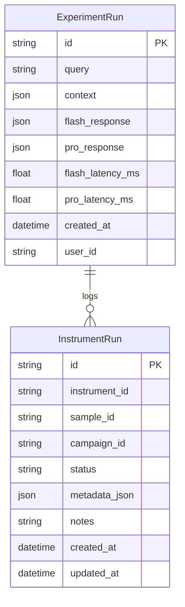

# Architecture Map

## Service Dependencies

## Run Targets

- `make run.api` — start the FastAPI RAG service on :8000.
- `make run.web` — launch the marketing/demo shell.
- `make demo` — boot the Next.js demos workspace.
- `make graph` — refresh this dependency map.
- `make audit` — regenerate audit findings JSON.

## Data Model

